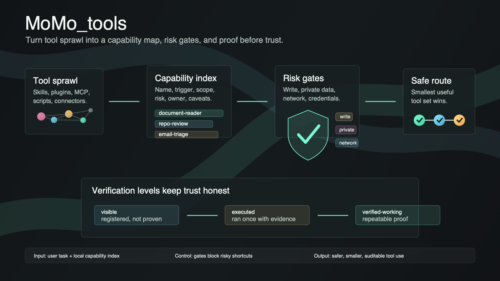

# MoMo_tools

**Stop giving agents every tool. Give them a capability map, a risk model, and proof before trust.**



MoMo_tools is a local-first capability router for AI coding agents. It helps you
turn a messy collection of skills, plugins, MCP servers, scripts, apps, and
connectors into a small, reviewable capability index.

It does not execute your private tools. It helps the agent decide what to use,
which gates apply, and whether a capability is merely visible or actually
verified.

## Why This Exists

Modern agents can see too many tools at once. That creates three problems:

- the agent picks noisy or risky tools when a smaller one would do;
- every installed skill/plugin competes for context;
- "installed" gets mistaken for "safe and working".

MoMo_tools adds a thin governance layer:

- **Capability index**: what exists, where it lives, what it is for.
- **Risk gates**: write access, private data, credentials, external network,
  browser/local app state, automation.
- **Verification levels**: `visible`, `executed`, `verified-working`.
- **Routing checks**: pick the smallest sufficient capability set.
- **Pressure tests**: catch prompts like "do not save" plus "remember this"
  before the agent does the wrong thing.

## Quickstart

Run directly from the repo:

```bash
./plugin/scripts/momo-tools validate
./plugin/scripts/momo-tools dashboard
./plugin/scripts/momo-tools route --prompt "Read this PDF, summarize it, do not save anything"
./plugin/scripts/momo-tools audit
./plugin/scripts/momo-tools pressure
./plugin/scripts/momo-tools test
```

Or install a local copy:

```bash
./scripts/install-local.sh
~/.momo-tools/bin/momo-tools dashboard
```

The installer only copies the public package into `~/.momo-tools` by default. It
does not modify Codex, Claude, Cursor, browser profiles, credentials, or shell
startup files.

## Use Your Own Workflow

Start from the sample index:

```bash
cp plugin/capabilities.example.json capabilities.local.json
```

Then replace the example capabilities with your own:

```json
{
  "name": "repo-review",
  "type": "skill",
  "trigger": ["review code", "security audit", "regression risk"],
  "scope": "local repo",
  "path_or_tool": "skills/repo-review/SKILL.md",
  "risk": ["read-only"],
  "source": "local",
  "owner": "you",
  "version": "0.1.0",
  "last_verified": "2026-07-08",
  "verification_level": "visible",
  "known_caveats": ["No runtime execution proof yet."],
  "canonical_for": ["code review"],
  "workflow_shape": "inspect -> findings -> tests"
}
```

Use the local file with:

```bash
./plugin/scripts/momo-tools --index capabilities.local.json dashboard
./plugin/scripts/momo-tools --index capabilities.local.json route --prompt "Review this repo for release risk"
```

## Verification Levels

| Level | Meaning |
|---|---|
| `visible` | Registered and discoverable. This does not prove login, runtime access, or success. |
| `executed` | Ran once on a bounded task and produced inspectable evidence. |
| `verified-working` | Has repeatable evidence and an explicit risk boundary. |

Promotion should be earned, not assumed. A capability should not become
`verified-working` just because it is installed.

## What This Public Version Does Not Include

- No private capability index.
- No real connector calls.
- No browser profile access.
- No email, Drive, Notion, database, or production writes.
- No local secrets or environment-specific paths.
- No automation that runs by itself.

## Project Shape

```text
plugin/
  .codex-plugin/plugin.json
  capabilities.example.json
  capabilities.example.yaml
  scripts/momo-tools
  skills/momo-tools/SKILL.md
docs/
  architecture.md
  risk-model.md
  verification-levels.md
  workflows.md
  tests.md
examples/
  personal-workflow.capabilities.yaml
  team-dev.capabilities.yaml
  docs-research.capabilities.yaml
tests/
  fixtures/route-cases.json
```

`docs/github-actions-ci.example.yml` contains an optional GitHub Actions
workflow. Copy it to `.github/workflows/ci.yml` after authenticating with a
GitHub token that has workflow scope.

## Design Principle

MoMo_tools is not a bigger toolbox. It is a decision layer that makes tool use
smaller, safer, and more auditable.
